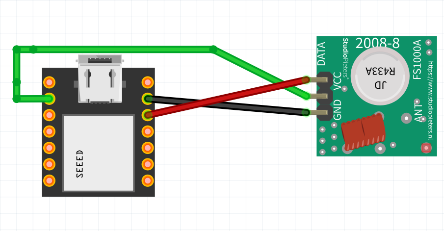

# OpenShock and Shock Bot setup guide

## Steps
 - [OpenShock setup](#openshock-setup)
   - [Parts](#parts)
   - [Hardware assembly](#hardware-assembly)
   - [Flashing firmware](#flashing-firmware)
   - [Adding the hub to your OpenShock account](#adding-the-hub-to-your-account)
   - [Pairing a shocker](#pairing-a-shocker)
 - [Bot Setup](#bot-setup)
   - [Jetstream setup](#jetstream-setup)
   - [Docker setup](#docker-setup)
   - [Build and configure locally](#build-and-configure-locally)

## OpenShock setup

### Parts
**Microcontroller** - You’ll need a wifi enabled microcontroller, I recommend the [Seeed XIAO ESP32S3](https://www.seeedstudio.com/XIAO-ESP32S3-p-5627.html) and will be using it for the tutorial, but Openshock has a list of other [compatible devices](https://wiki.openshock.org/hardware/boards/).

**RF Transmitter** - The shockers are controlled on the 433Mhz radio frequency, so you’ll need a transmitter. Open shock recommends [this transmitter/receiver kit](https://www.aliexpress.us/item/2251832634295432.html), though you’ll only need the transmitter. I will be using [this type of transmitter](https://www.aliexpress.us/item/3256804672385982.html) for the tutorial, but any generic 433Mhz transmitter should work.

**Shockers** - [These are the shockers](https://www.aliexpress.us/item/3256804946732233.html) recommended by openshock. I recommend the 3 pack, because it's a better deal.

### Hardware assembly

Either on a breadboard or soldered,
- Connect VCC to the 3V3 rail of the microcontroller 
- Connect GND to GND of the microcontroller 
- Connect the Data pin to GPIO2 (D1) of the microcontroller




### Flashing firmware
(*Work in progress*)

[//]: # (idk if i really need to or want to do more here. as i was working on the other sections i realized i'm just rewriting existing guides)

- Plug in the microcontroller and use [this web based Flash Tool](https://next.openshock.app/flashtool)
- For more information, see the [OpenShock guide](https://wiki.openshock.org/guides/openshock-how-to-flash-your-board/#what-you-need)
### Adding the hub to your account

For the following steps, you'll need your smartphone and an OpenShock account. You should have the [dashboard](https://openshock.app/#/dashboard/home) open on a computer (or device other than your phone).

- Ensure the device is plugged in and powered on
- On your phone, connect to the Wi-Fi network named similar to `OpenShock-XX:XX:XX:XX:XX:XX`
  - If your phone complains about it not having internet, choose the option to connect anyway 
- Open your phone web browser and go to `10.10.10.10`
- Connect to your Wi-Fi
  - Find your Wi-Fi network in the mobile UI and press the green button next to it
  - Type in your Wi-Fi password and press submit
- In the mobile UI, enter the number 2 if a different number is prefilled, the press the Set button
- Pair the hub
  - On the OpenShock dashboard, go to the [Hubs](https://openshock.app/#/dashboard/devices) tab
  - At the bottom right, click the green + button
  - A new hub will appear in your account. On the right of the new shocker, click the 3 dots button, and in the dropdown menu, click pair.
  - In the browser on your phone, enter the pair code in the field and click Pair

If it all worked, there should be a green status icon next to the new hub!


### Pairing a shocker
- In the Openshock dashboard, go to Shockers, click the green + icon. Select the new hub, give the shocker  a name, and save it.
- With your physical shocker device, hold the power button until it beeps and flashes rapidly.
- Back on the dashboard, click the vibrate button on the new shocker. This should cause your shocker to vibrate, and thus be paired.


### Get an API key

## Bot setup 
***The bot is not ready or published yet.*** This is just me doing the initial work in preparation for it, this part of the docs will likely be moved to the bot repo.

### Configure environment
In the directory you'll be running the bot, create a directory named "sessionData" (or change the directory with the env variable `SESSION_DATA_PATH`) \
Then, create a file named `.env` with the necessary variables

```.dotenv
JETSTREAM_URL=ws://jetstream:6008/subscribe
#JETSTREAM_URL=ws://localhost:6008/subscribe


SHOCKBOT_BSKY_HANDLE=
# USE AN APP PASSWORD
SHOCKBOT_BSKY_PASSWORD=

OPENSHOCK_API_TOKEN=

#SESSION_DATA_PATH=

# Optional parameters depending on how you'll run the bot
#OPTIONAL_URL=

```


### Build and configure locally

#### Prerequisites

**Bun** - Bun has a really easy [install guide](https://bun.sh/docs/installation)! I work in a WSL setup, so I'm "using linux", but this should work on regular ol' windows too 

**IDE** - Any Typescript IDE should do, use your favorite. I use Jetbrains IDEs for everything, so I'm using WebStorm (which just recently became free for personal use) #NotSponsored(ButIShouldBe) 

**Git** - To clone the repo

#### Clone repo

`git clone git@github.com:juni-b-queer/bsky-remind-me-bot.git` \
`cd bsky-shock-bot` 

Add the `.env` file from earlier into this directory

#### Docker compose (recommended)

Create a file `docker-compose.yml` and add the following YAML
```yaml
services:
  bskyshockbot:
    depends_on:
      - jetstream
    build: .
    restart: unless-stopped
    env_file:
      - .env
    volumes:
      - ./sessionData:/sessionData
    networks:
      - bskybotnetwork

  jetstream:
    image: {CONTAINER}
    container_name: jetstream
    restart: unless-stopped
    environment:
      - CURSOR_FILE=/data/cursor.json
    ports:
      - "6008:6008"
    volumes:
      - ./data:/data
    networks:
      - bskybotnetwork

networks:
  bskybotnetwork:
    driver: bridge

```

To start the bot, run `docker compose up`

To run it without logs, run `docker compose up -d`. Stop it with `docker compose down`

#### Docker CLI

Create the network `docker network create -d bridge bsky-bot-network`

Run Jetstream `docker run -e CURSOR_FILE=/data/cursor.json -v ./data:/data --network bsky-bot-network --name jetstream -d {CONTAINER}`

Build the container with `docker build . -t $USER/bsky-shock-bot`

Run the built container with `docker run --env-file .env -v ./sessionData:/sessionData --network bsky-bot-network $USER/bsky-shock-bot`


#### Edit the handlers
*WIP*

The bot can be edited! It's not built and ready yet, but it will be soon!
I'll add some easy to edit basic functionality to it so that you can tweak it for your needs.

#### Run in development

*WIP*

`docker compose up -d jetstream`

`bun run ./src/index.ts`


### Docker setup

Will I get around to making and publishing a basic bot? Or will building and running from source be the only way? \
*The world my never know*

#### Pull the image

#### Run the bot container on the command line

#### Run the bot with a docker compose file

